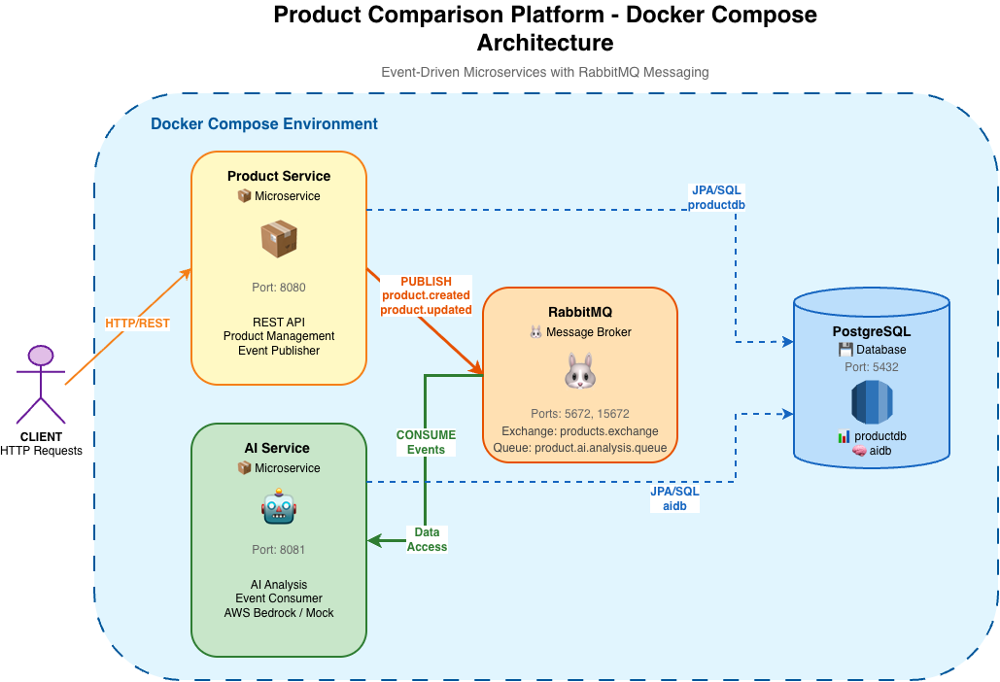
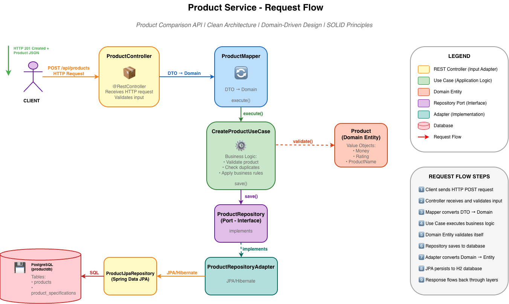
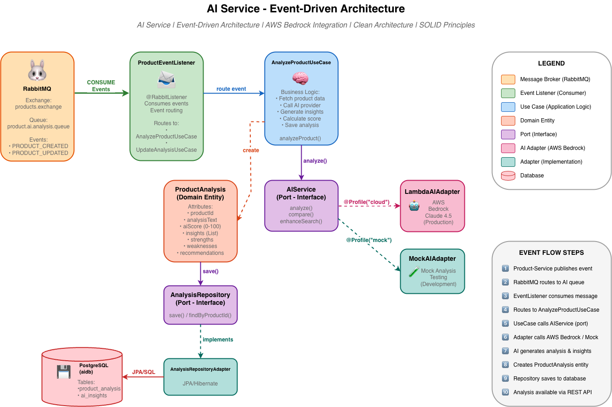
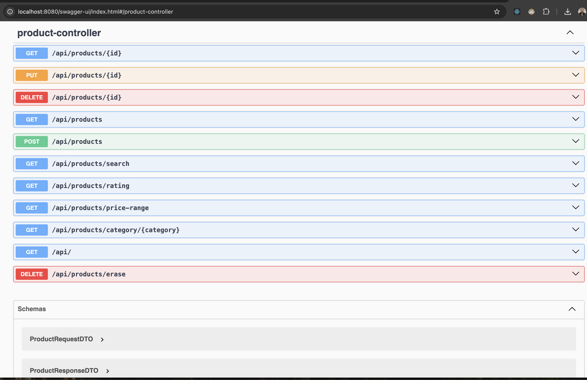
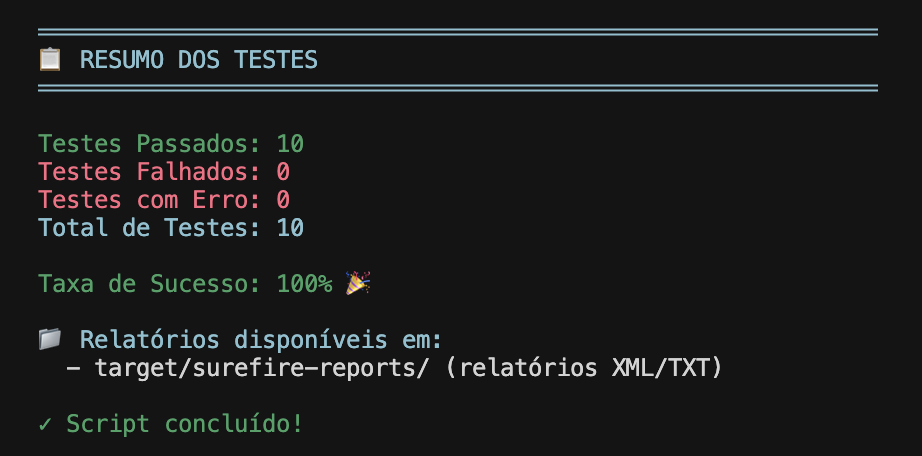
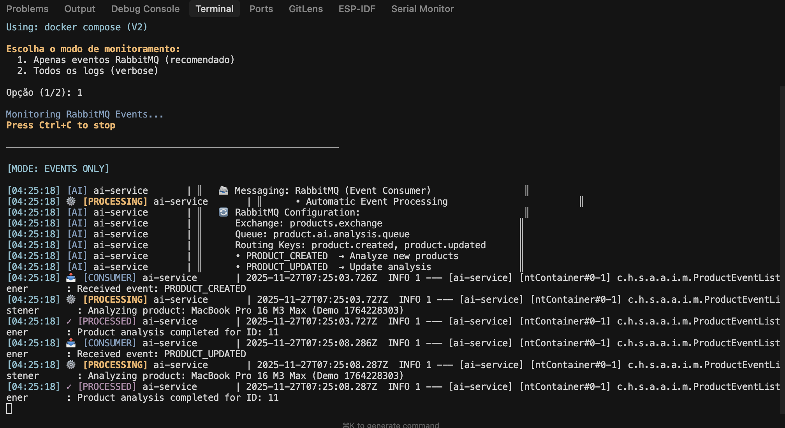

# Product Comparison Platform

<div align="center">

> ⚠️ **Looking for advanced features?** Check out the [`improvement`](../../tree/improvement) branch for AWS EKS deployment, Terraform IaC, and production-ready infrastructure!

<br/>


**Enterprise-grade Event-Driven Microservices Platform with AI Integration**

*Clean Architecture • SOLID Principles • Domain-Driven Design • Event-Driven Architecture*

[Features](#-features) • [Architecture](#-architecture) • [Quick Start](#-quick-start) • [Documentation](#-documentation) • [Deployment](#-deployment)

</div>

---

## 📋 Table of Contents

- [Overview](#-overview)
- [Features](#-features)
- [System Architecture](#-system-architecture)
  - [Docker Compose (Development)](#docker-compose-architecture)
- [Microservices Architecture](#-microservices-architecture)
  - [Product Service](#product-service-architecture)
  - [AI Service](#ai-service-architecture)
- [Tech Stack](#-tech-stack)
- [Quick Start](#-quick-start)
- [API Documentation](#-api-documentation)
- [Testing](#-testing)
- [Deployment](#-deployment)
  - [Local (Docker Compose)](#local-development)
- [Project Structure](#-project-structure)
- [Contributing](#-contributing)
- [License](#-license)

---

## 🎯 Overview

**Product Comparison Platform** is a production-ready, event-driven microservices platform designed for e-commerce product analysis and comparison. Built with **Clean Architecture** principles, the system leverages **AI-powered insights** using AWS Bedrock (Claude 4.5) to deliver intelligent product recommendations.

### 🌟 Key Highlights
```
✅ Event-Driven Architecture    → RabbitMQ message broker with async processing
✅ Clean Architecture           → Domain-centric design, framework-independent
✅ Microservices Pattern        → 2 independent services with clear boundaries
✅ AI Integration               → AWS Bedrock Claude 4.5 for product analysis
✅ DevSecOps Ready              → GitHub Actions, Trivy, SonarQube, ArgoCD
✅ Cloud Native                 → Kubernetes/EKS deployment with Terraform IaC
✅ Production Ready             → Multi-AZ, auto-scaling, monitoring, backup
```

---

## ✨ Features

### Core Capabilities

| Feature | Description |
|---------|-------------|
| 🛍️ **Product Management** | Full CRUD operations with REST API |
| 🤖 **AI-Powered Analysis** | Automatic product insights via AWS Bedrock |
| 🔍 **Advanced Search** | Filter by category, price range, ratings |
| 📊 **Product Comparison** | Side-by-side comparison with AI recommendations |
| 📨 **Event-Driven** | Async processing with RabbitMQ messaging |
| 🔄 **Real-time Updates** | Product changes trigger automatic AI analysis |

### Technical Features
```
🏗️  Clean Architecture        📦 Value Objects (Money, Rating)
🎯  SOLID Principles          🔌 Repository Pattern
📡  Event-Driven Messaging    🐳 Docker Compose support
☸️  Kubernetes Ready          🧪 Comprehensive test coverage
🔐  Input Validation          📖 OpenAPI/Swagger docs
```

---

## 🏗️ System Architecture

### Docker Compose Architecture

**Development Environment** - Run locally with Docker Compose



**Components:**
- **Product Service** (Port 8080) - REST API, Event Publisher
- **AI Service** (Port 8081) - Event Consumer, AI Analysis
- **RabbitMQ** (Ports 5672, 15672) - Message Broker
- **PostgreSQL** - Databases: `productdb`, `aidb`
```bash
# Start all services
docker-compose up -d

# View logs
docker-compose logs -f

# Access services
http://localhost:8080  # Product Service API
http://localhost:8081  # AI Service API
http://localhost:15672 # RabbitMQ Management (guest/guest)
```
---

## 🔬 Microservices Architecture

### Product Service Architecture

**Request Flow** - HTTP REST API with Clean Architecture



**Flow:**
```
1️⃣ Client sends HTTP POST request
2️⃣ ProductController receives and validates input
3️⃣ ProductMapper converts DTO → Domain
4️⃣ CreateProductUseCase executes business logic
5️⃣ Product Entity validates itself (Value Objects)
6️⃣ ProductRepository saves to database
7️⃣ ProductRepositoryAdapter converts Domain → JPA Entity
8️⃣ JPA persists to PostgreSQL (productdb)
9️⃣ **Publishes event** to RabbitMQ (product.created)
```

**Endpoints:**
- `POST /api/products` - Create product
- `GET /api/products` - List products
- `GET /api/products/{id}` - Get product by ID
- `PUT /api/products/{id}` - Update product
- `DELETE /api/products/{id}` - Delete product
- `GET /api/products/category/{category}` - Filter by category
- `GET /api/products/search?keyword=x` - Search products

---

### AI Service Architecture

**Event-Driven Flow** - Async AI analysis via RabbitMQ



**Flow:**
```
1️⃣ Product-Service publishes event to RabbitMQ
2️⃣ RabbitMQ routes to product.ai.analysis.queue
3️⃣ ProductEventListener consumes message
4️⃣ Routes to AnalyzeProductUseCase
5️⃣ UseCase calls AIService (port)
6️⃣ LambdaAIAdapter calls AWS Bedrock Claude 4.5
7️⃣ AI generates analysis & insights (strengths, weaknesses, score)
8️⃣ Creates ProductAnalysis entity
9️⃣ AnalysisRepository saves to PostgreSQL (aidb)
🔟 Analysis available via REST API
```

**AI Providers:**
- **Production:** AWS Bedrock Claude 4.5 (`@Profile("cloud")`)
- **Development:** Mock AI Adapter (`@Profile("mock")`)

**Analysis Output:**
```json
{
  "productId": 1,
  "analysisText": "High-quality flagship smartphone...",
  "aiScore": 92,
  "insights": ["Premium build quality", "Excellent camera"],
  "strengths": ["Performance", "Design"],
  "weaknesses": ["Price premium"],
  "recommendations": ["Best for power users"]
}
```

---

## 🛠️ Tech Stack

### Backend Services

| Technology | Version | Purpose |
|------------|---------|---------|
| ☕ **Java** | 21 LTS | Programming language |
| 🍃 **Spring Boot** | 3.2.0 | Application framework |
| 🗄️ **Spring Data JPA** | 3.2.0 | Data access layer |
| 🐰 **RabbitMQ** | 3.12 | Message broker |
| 🐘 **PostgreSQL** | 15 | Relational database |
| 🧠 **AWS Bedrock** | Claude 4.5 | AI analysis (production) |
| 🔨 **Maven** | 3.9+ | Build tool |

### DevOps & Cloud

| Technology | Version | Purpose |
|------------|---------|---------|
| 🐳 **Docker** | 24.0+ | Containerization |
| ☸️ **Kubernetes** | 1.28 | Container orchestration |
| 🏗️ **Terraform** | 1.6+ | Infrastructure as Code |
| ⚡ **GitHub Actions** | - | CI/CD pipeline |
| 🔄 **ArgoCD** | 2.9+ | GitOps deployment |
| 🛡️ **Trivy** | Latest | Security scanning |
| 📊 **SonarQube** | 10.3+ | Code quality |
| ☁️ **AWS** | - | Cloud provider (EKS, RDS, MQ, Bedrock) |

### Testing & Documentation
```
🧪 JUnit 5             📖 Springdoc OpenAPI
🎭 Mockito             📝 Swagger UI
✅ REST Assured         🔍 Jacoco (Coverage)
```

---

## 🚀 Quick Start

### Prerequisites
```bash
# Required
Java 21+
Maven 3.9+
Docker & Docker Compose

# Check versions
java --version
mvn --version
docker --version
docker-compose --version
```

### Local Development (Docker Compose)
```bash
# 1. Clone repository
git clone https://github.com/vynnydev/product-comparison-platform.git
cd product-comparison-platform

# 2. Start all services
docker-compose up -d

# 3. Verify services are running
docker-compose ps

# 4. View logs
docker-compose logs -f product-service
docker-compose logs -f ai-service

# 5. Test the API
curl http://localhost:8080/api/products
```

### Service Endpoints

| Service | URL | Credentials |
|---------|-----|-------------|
| 📦 **Product Service** | http://localhost:8080 | - |
| 🤖 **AI Service** | http://localhost:8081 | - |
| 📖 **Swagger (Product)** | http://localhost:8080/swagger-ui.html | - |
| 📖 **Swagger (AI)** | http://localhost:8081/swagger-ui.html | - |
| 🐰 **RabbitMQ Management** | http://localhost:15672 | guest / guest |

---

## 📡 API Documentation

### Product Service API

**Base URL:** `http://localhost:8080/api`

#### Create Product
```bash
curl -X POST http://localhost:8080/api/products \
  -H "Content-Type: application/json" \
  -d '{
    "name": "MacBook Pro 16 M3 Max",
    "description": "Powerful laptop for developers",
    "imageUrl": "https://example.com/macbook.jpg",
    "price": 3499.99,
    "rating": 4.9,
    "category": "Laptops",
    "inStock": true,
    "specifications": {
      "processor": "M3 Max",
      "ram": "64GB",
      "storage": "2TB SSD"
    }
  }'
```

**Response:** `201 Created`
```json
{
  "id": 1,
  "name": "MacBook Pro 16 M3 Max",
  "price": 3499.99,
  "rating": 4.9,
  "createdAt": "2024-11-27T19:00:00"
}
```

> 🎯 **This triggers an event** → AI Service automatically analyzes the product

#### Get AI Analysis
```bash
curl http://localhost:8081/api/ai/product/1
```

**Response:** `200 OK`
```json
{
  "productId": 1,
  "aiScore": 95,
  "analysisText": "Premium professional laptop with exceptional performance...",
  "insights": [
    "Top-tier M3 Max processor delivers outstanding performance",
    "64GB RAM ideal for heavy multitasking",
    "Excellent build quality and design"
  ],
  "strengths": ["Performance", "Display", "Build Quality"],
  "weaknesses": ["High price point", "Limited upgradeability"],
  "recommendations": ["Best for professional developers and content creators"]
}
```

### Interactive API Documentation

Access Swagger UI for complete API documentation:

- **Product Service:** http://localhost:8080/swagger-ui.html
- **AI Service:** http://localhost:8081/swagger-ui.html



---

## 🧪 Testing

### Run All Tests
```bash
# Product Service tests
cd backend/services/product-service
mvn clean test

# AI Service tests
cd backend/services/ai-service
mvn clean test

# Integration tests
cd backend/scripts/integrated-tests/product-service
./integrated-tests.sh
```

### Test Coverage
```bash
# Generate coverage report
mvn clean test jacoco:report

# View report
open target/site/jacoco/index.html
```

**Current Coverage:** 85%



### Test Event Flow
```bash
# Test complete event-driven flow
cd backend/scripts/messaging
./demo-events.sh

# Monitor RabbitMQ
./monitor-rabbitmq.sh
```



---

## 🚢 Deployment

### Local Development

**Requirements:** Docker & Docker Compose
```bash
# Start services
docker-compose up -d

# Scale services
docker-compose up -d --scale product-service=3

# Stop services
docker-compose down

# Clean everything
docker-compose down -v
```

---

## 📂 Project Structure

### Monorepo Organization
```
product-comparison-platform/
├── backend/
│   ├── services/
│   │   ├── product-service/          # 📦 Product Management
│   │   │   ├── src/
│   │   │   │   ├── main/java/.../
│   │   │   │   │   ├── adapter/      # Controllers, DTOs
│   │   │   │   │   ├── domain/       # Entities, Value Objects
│   │   │   │   │   ├── usecase/      # Business Logic
│   │   │   │   │   └── config/       # Spring Config
│   │   │   │   └── resources/
│   │   │   ├── Dockerfile
│   │   │   └── pom.xml
│   │   │
│   │   └── ai-service/                # 🤖 AI Analysis
│   │       ├── src/
│   │       │   ├── main/java/.../
│   │       │   │   ├── adapter/
│   │       │   │   │   ├── input/messaging/  # Event Listeners
│   │       │   │   │   └── output/ai/        # Bedrock/Mock Adapters
│   │       │   │   ├── domain/
│   │       │   │   ├── usecase/
│   │       │   │   └── config/
│   │       │   └── resources/
│   │       ├── Dockerfile
│   │       └── pom.xml
│   │
│   ├── scripts/
│   │   ├── messaging/
│   │   │   ├── demo-events.sh         # Test event flow
│   │   │   └── monitor-rabbitmq.sh    # Monitor messages
│   │   └── integrated-tests/          # Integration tests
│   │
│   └── docker-compose.yaml             # Local environment
│
├── infrastructure/                    
│   ├── terraform/
│   │   ├── modules/
│   │   │   ├── vpc/
│   │   │   ├── eks/
│   │   │   ├── rds/
│   │   │   └── mq/
│   │   ├── main.tf
│   │   └── variables.tf
│   └── scripts/
│
├── docs/
│   ├── architecture/
│   │   └── images/                    # Architecture diagrams
│   └── images/                        # Screenshots
│
├── .github/
│   └── workflows/
│       ├── ci-product-service.yml
│       ├── ci-ai-service.yml
│       └── terraform.yml
│
└── README.md
```

### Service Architecture (Clean Architecture)
```
Each service follows the same structure:

adapter/
  ├── input/          # REST Controllers, Event Listeners
  ├── output/         # Repositories, External APIs
  └── mapper/         # DTOs ↔ Domain conversion

domain/
  ├── model/          # Entities (Aggregate Roots)
  ├── valueobject/    # Money, Rating, etc.
  ├── repository/     # Ports (Interfaces)
  └── exception/      # Domain exceptions

usecase/              # Application business logic
  ├── CreateProductUseCase.java
  ├── AnalyzeProductUseCase.java
  └── ...

config/               # Spring configuration
```

---

## 💎 Best Practices

### Clean Architecture Principles
```
✅ Domain Independence       → Core logic has zero framework dependencies
✅ Dependency Inversion      → All dependencies point inward
✅ Testability              → Easy to test without mocking frameworks
✅ Flexibility              → Swap frameworks without changing business logic
```

### SOLID Principles

| Principle | Implementation |
|-----------|----------------|
| **S**ingle Responsibility | Each class has one reason to change |
| **O**pen/Closed | Open for extension, closed for modification |
| **L**iskov Substitution | Implementations interchangeable via interfaces |
| **I**nterface Segregation | Focused, specific interfaces |
| **D**ependency Inversion | Depend on abstractions, not concretions |

### Event-Driven Patterns
```
📨 Async Communication     → Services communicate via events
🔄 Eventual Consistency   → Data synchronized asynchronously
📊 Event Sourcing Ready   → Events as source of truth
🎯 Decoupled Services     → Services don't know about each other
```

---

## 🤝 Contributing

Contributions are welcome! Please follow these guidelines:

### Workflow
```bash
# 1. Fork the repository
# 2. Create feature branch
git checkout -b feature/amazing-feature

# 3. Make changes and test
mvn clean test

# 4. Commit with conventional commits
git commit -m "feat: add amazing feature"

# 5. Push and create PR
git push origin feature/amazing-feature
```

### Commit Convention

Follow [Conventional Commits](https://www.conventionalcommits.org/):
```
feat:      New feature
fix:       Bug fix
docs:      Documentation changes
refactor:  Code refactoring (no behavior change)
test:      Adding or updating tests
chore:     Maintenance tasks
ci:        CI/CD changes
```

### Code Quality
```bash
# Run all checks before committing
mvn clean verify                    # Build + tests
mvn spotless:check                  # Code formatting
mvn checkstyle:check               # Style violations
```

---

## 📄 License

This project is licensed under the **MIT License** - see the [LICENSE](LICENSE) file for details.

---

## 👨‍💻 Author

**Vinicius Prudencio (Vini)**  
*Backend Developer & DevOps Engineer*

- 🚀 Specialized in Clean Architecture & Cloud-Native Solutions
- ☁️ AWS | Terraform | Kubernetes | ArgoCD | GitHub Actions
- 💼 [LinkedIn](https://linkedin.com/in/vinicius-prudencio)
- 🐙 [GitHub](https://github.com/vynnydev)

---

## 🙏 Acknowledgments

- **Uncle Bob** - Clean Architecture principles
- **Eric Evans** - Domain-Driven Design concepts
- **Spring Team** - Excellent framework and documentation
- **AWS** - Cloud infrastructure and AI services
- **Open Source Community** - Amazing tools and libraries

---

<div align="center">

### 🌟 **Made with ❤️ using Clean Architecture, Event-Driven Design, and AI**

[](https://github.com/vynnydev/product-comparison-platform)

**If you found this helpful, please ⭐ star the repository!**

---

**Branches:**
- `main` / `develop` - Docker Compose (Local Development)
- `improvement` - AWS EKS + Terraform (Production Ready)

</div>