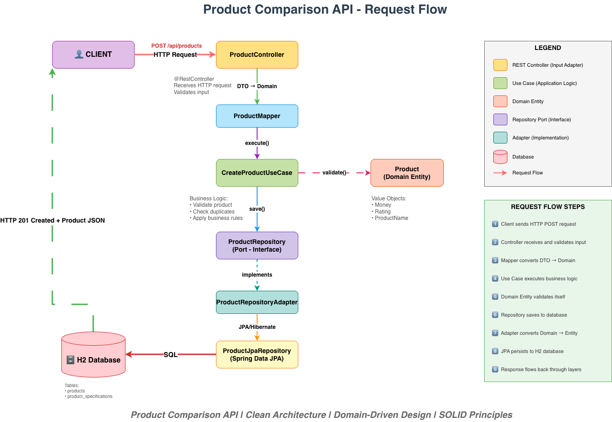
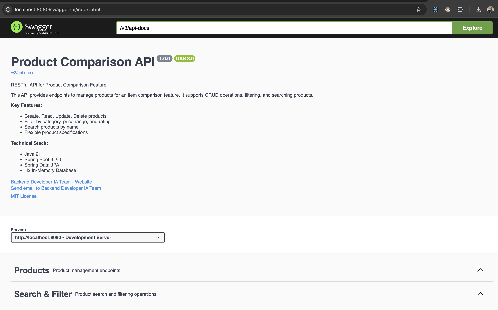
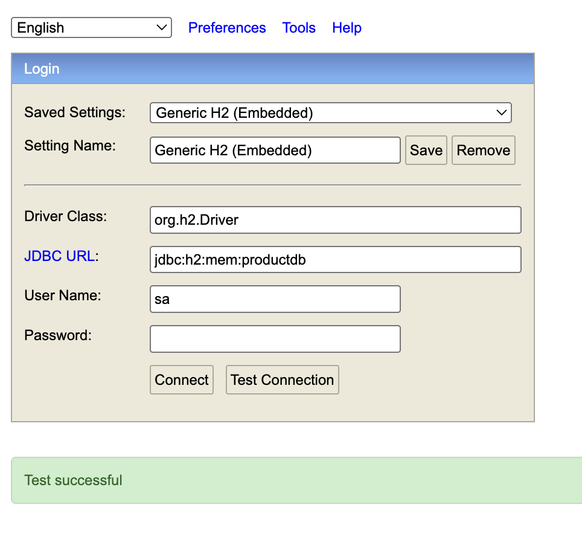
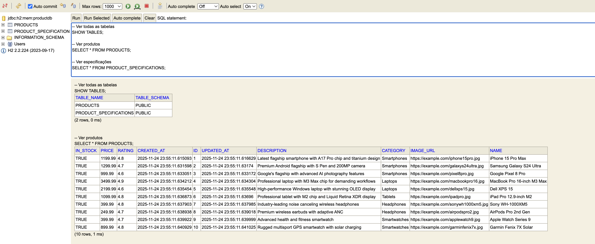

# Product Comparison Platform - Backend API

<div align="center">


**Enterprise-grade RESTful API built with Clean Architecture, SOLID principles, and DDD patterns**

[Features](#-features) • [Architecture](#-architecture) • [Getting Started](#-getting-started) • [API Documentation](#-api-documentation) • [Tech Stack](#-tech-stack)

</div>

---

## 📋 Table of Contents

- [About](#-about)
- [Features](#-features)
- [Architecture](#-architecture)
- [Tech Stack](#-tech-stack)
- [Getting Started](#-getting-started)
- [API Documentation](#-api-documentation)
- [Database](#-database)
- [Testing](#-testing)
- [Project Structure](#-project-structure)
- [Best Practices](#-best-practices)
- [Contributing](#-contributing)
- [License](#-license)

---

## 🎯 About

Product Comparison Platform is a modern, scalable backend API designed for e-commerce product comparison features. Built following **Clean Architecture** principles, the system separates business logic from frameworks, ensuring maintainability, testability, and flexibility.

### Key Highlights

- ✅ **Clean Architecture** - Domain-centric design with clear separation of concerns
- ✅ **SOLID Principles** - Every class follows Single Responsibility, Open/Closed, and Dependency Inversion
- ✅ **DDD Patterns** - Value Objects, Aggregates, and Domain Events
- ✅ **Layered Design** - Domain → Use Cases → Adapters → Infrastructure
- ✅ **RESTful API** - Standard HTTP methods, proper status codes, and JSON responses
- ✅ **Production Ready** - Exception handling, logging, and validation

---

## ✨ Features

### Core Functionality

- 🛍️ **Product Management** - Full CRUD operations for products
- 🔍 **Advanced Search** - Filter by category, price range, and ratings
- 📊 **Product Comparison** - Compare multiple products side-by-side
- 💰 **Price Filtering** - Find products within budget
- ⭐ **Rating System** - Filter by minimum rating threshold
- 🏷️ **Category Navigation** - Browse products by category
- 📝 **Specifications** - Flexible key-value product specifications
- 🔐 **Input Validation** - Comprehensive validation using Jakarta Bean Validation

### Technical Features

- 🏗️ **Modular Architecture** - Easy to extend and maintain
- 📦 **Value Objects** - Money, Rating, and ProductName with built-in validation
- 🔄 **Repository Pattern** - Clean abstraction over data access
- 🎯 **Use Case Driven** - Business logic encapsulated in focused use cases
- 🗺️ **DTOs & Mappers** - Clear boundaries between layers
- ⚡ **H2 In-Memory DB** - Fast development and testing
- 📖 **Swagger/OpenAPI** - Interactive API documentation
- 🧪 **Comprehensive Tests** - Unit and integration tests

---

## 🏗️ Architecture

### Clean Architecture Diagram

<!-- Adicione aqui a imagem da arquitetura -->


### Architecture Layers
```
┌─────────────────────────────────────────────────────────────┐
│                    FRAMEWORKS & DRIVERS                     │
│              Spring Boot, JPA, H2 Database                  │
├─────────────────────────────────────────────────────────────┤
│                   INTERFACE ADAPTERS                        │
│         Controllers, DTOs, Repositories, Mappers            │
├─────────────────────────────────────────────────────────────┤
│                 APPLICATION BUSINESS RULES                  │
│                        Use Cases                            │
├─────────────────────────────────────────────────────────────┤
│                ENTERPRISE BUSINESS RULES                    │
│           Entities, Value Objects, Domain Logic             │
└─────────────────────────────────────────────────────────────┘
```

### Dependency Rule

**All dependencies point inward** - Inner circles know nothing about outer circles.

- ✅ Use Cases depend on Domain
- ✅ Adapters depend on Use Cases
- ✅ Infrastructure depends on Adapters
- ❌ Domain NEVER depends on frameworks

---

## 🛠️ Tech Stack

### Core Technologies

| Technology | Version | Purpose |
|------------|---------|---------|
| **Java** | 21 LTS | Programming Language |
| **Spring Boot** | 3.2.0 | Application Framework |
| **Spring Data JPA** | 3.2.0 | Data Access Layer |
| **Hibernate** | 6.3.1 | ORM Implementation |
| **H2 Database** | 2.2.224 | In-Memory Database |
| **Maven** | 3.9+ | Build Tool |

### Libraries & Tools

- **Jakarta Validation** - Bean validation
- **Springdoc OpenAPI** - API documentation
- **JUnit 5** - Unit testing
- **Mockito** - Mocking framework
- **REST Assured** - API testing
- **Jackson** - JSON processing

---

## 🚀 Getting Started

### Prerequisites
```bash
# Java 21 or higher
java --version

# Maven 3.8+
mvn --version
```

### Installation
```bash
# 1. Clone repository
git clone https://github.com/your-username/product-comparison-platform.git
cd product-comparison-platform/backend

# 2. Build project
mvn clean install

# 3. Run application
mvn spring-boot:run
```

### Quick Start (Docker)
```bash
# Build and run
docker-compose up -d

# View logs
docker-compose logs -f

# Stop
docker-compose down
```

### Access Points

Once running, access:

- 🌐 **API Base**: http://localhost:8080/api
- 📖 **Swagger UI**: http://localhost:8080/swagger-ui.html
- 🗄️ **H2 Console**: http://localhost:8080/h2-console
  - JDBC URL: `jdbc:h2:mem:productdb`
  - Username: `sa`
  - Password: *(empty)*

---

## 📡 API Documentation

### Swagger UI

<!-- Adicione aqui a imagem do Swagger -->



### Base URL
```
http://localhost:8080/api
```

### Endpoints Overview

| Method | Endpoint | Description |
|--------|----------|-------------|
| GET | `/` | Health check |
| POST | `/products` | Create product |
| GET | `/products` | List all products |
| GET | `/products/{id}` | Get product by ID |
| PUT | `/products/{id}` | Update product |
| DELETE | `/products/{id}` | Delete product |
| DELETE | `/products/erase` | Delete all products |
| GET | `/products/category/{category}` | Filter by category |
| GET | `/products/price-range?min=x&max=y` | Filter by price |
| GET | `/products/rating?min=x` | Filter by rating |
| GET | `/products/search?keyword=x` | Search by name |

### Sample Requests

#### Create Product
```bash
curl -X POST http://localhost:8080/api/products \
  -H "Content-Type: application/json" \
  -d '{
    "name": "iPhone 15 Pro Max",
    "description": "Latest flagship smartphone",
    "imageUrl": "https://example.com/iphone.jpg",
    "price": 1199.99,
    "rating": 4.8,
    "category": "Smartphones",
    "inStock": true,
    "specifications": {
      "storage": "256GB",
      "color": "Titanium Blue",
      "processor": "A17 Pro"
    }
  }'
```

#### Get All Products
```bash
curl http://localhost:8080/api/products
```

#### Filter by Category
```bash
curl http://localhost:8080/api/products/category/Smartphones
```

#### Search Products
```bash
curl http://localhost:8080/api/products/search?keyword=iPhone
```

### Response Format

**Success Response:**
```json
{
  "id": 1,
  "name": "iPhone 15 Pro Max",
  "description": "Latest flagship smartphone",
  "imageUrl": "https://example.com/iphone.jpg",
  "price": 1199.99,
  "rating": 4.8,
  "category": "Smartphones",
  "inStock": true,
  "specifications": {
    "storage": "256GB",
    "color": "Titanium Blue"
  },
  "createdAt": "2024-11-24T20:30:00",
  "updatedAt": "2024-11-24T20:30:00"
}
```

**Error Response:**
```json
{
  "timestamp": "2024-11-24T20:30:00",
  "status": 404,
  "error": "Not Found",
  "message": "Product with ID 999 not found",
  "path": "/api/products"
}
```

---

## 🗄️ Database

### Schema Overview

<!-- Adicione aqui a imagem do banco -->



### Tables

**products**
```sql
CREATE TABLE products (
    id BIGINT AUTO_INCREMENT PRIMARY KEY,
    name VARCHAR(255) NOT NULL,
    description VARCHAR(2000),
    image_url VARCHAR(255) NOT NULL,
    price DECIMAL(10,2) NOT NULL,
    rating DECIMAL(2,1) DEFAULT 0.0,
    category VARCHAR(255) NOT NULL,
    in_stock BOOLEAN DEFAULT TRUE,
    created_at TIMESTAMP NOT NULL,
    updated_at TIMESTAMP
);
```

**product_specifications**
```sql
CREATE TABLE product_specifications (
    product_id BIGINT NOT NULL,
    spec_key VARCHAR(255),
    spec_value VARCHAR(500),
    FOREIGN KEY (product_id) REFERENCES products(id) ON DELETE CASCADE
);
```

### Sample Data

The application includes a database seeder with 10+ sample products across 5 categories:
- 📱 Smartphones (iPhone, Samsung, Google)
- 💻 Laptops (MacBook, Dell, Lenovo)
- 📱 Tablets (iPad, Galaxy Tab)
- 🎧 Headphones (Sony, AirPods)
- ⌚ Smartwatches (Apple Watch, Garmin)

---

## 🧪 Testing

### Run All Tests
```bash
mvn test
```

### Test Coverage
```bash
mvn clean test jacoco:report
```

View report at: `target/site/jacoco/index.html`

### Test Structure
```
src/test/java/
├── ProductServiceTest.java           # Unit tests for business logic
└── ProductControllerIntegrationTest.java  # Integration tests
```

### Example Test
```java
@Test
@DisplayName("Should create product successfully")
void testCreateProduct() {
    // Given
    Product product = createTestProduct();
    
    // When
    Product result = createProductUseCase.execute(product);
    
    // Then
    assertNotNull(result.getId());
    assertEquals("iPhone 15 Pro", result.getName());
}
```

---

## 📂 Project Structure
```
backend/
├── src/
│   ├── main/
│   │   ├── java/com/hackerrank/sample/
│   │   │   ├── domain/                    # 🟡 Enterprise Business Rules
│   │   │   │   ├── model/
│   │   │   │   │   └── Product.java      # Aggregate Root
│   │   │   │   ├── valueobject/
│   │   │   │   │   ├── Money.java
│   │   │   │   │   ├── Rating.java
│   │   │   │   │   └── ProductName.java
│   │   │   │   ├── repository/
│   │   │   │   │   └── ProductRepository.java  # Port
│   │   │   │   └── exception/
│   │   │   │       └── DomainException.java
│   │   │   │
│   │   │   ├── usecase/                   # 🟠 Application Business Rules
│   │   │   │   ├── CreateProductUseCase.java
│   │   │   │   ├── GetProductByIdUseCase.java
│   │   │   │   └── SearchProductsUseCase.java
│   │   │   │
│   │   │   ├── adapter/                   # 🟢 Interface Adapters
│   │   │   │   ├── input/
│   │   │   │   │   ├── rest/
│   │   │   │   │   │   └── ProductController.java
│   │   │   │   │   └── dto/
│   │   │   │   │       ├── ProductRequestDTO.java
│   │   │   │   │       └── ProductResponseDTO.java
│   │   │   │   ├── output/
│   │   │   │   │   └── persistence/
│   │   │   │   │       ├── ProductRepositoryAdapter.java
│   │   │   │   │       └── entity/
│   │   │   │   │           └── ProductEntity.java
│   │   │   │   └── mapper/
│   │   │   │       └── ProductMapper.java
│   │   │   │
│   │   │   ├── config/                    # 🔵 Configuration
│   │   │   │   ├── UseCaseConfiguration.java
│   │   │   │   └── OpenApiConfig.java
│   │   │   │
│   │   │   └── Application.java           # Main
│   │   │
│   │   └── resources/
│   │       └── application.properties
│   │
│   └── test/
│       └── java/com/hackerrank/sample/
│           ├── ProductServiceTest.java
│           └── ProductControllerIntegrationTest.java
│
├── docs/
│   └── images/
│       ├── clean-architecture-diagram.png
│       ├── swagger-ui.png
│       └── database-schema.png
│
├── pom.xml
├── Dockerfile
├── docker-compose.yml
└── README.md
```

---

## 💎 Best Practices

### Clean Architecture

✅ **Domain Independence** - Core business logic has zero framework dependencies  
✅ **Testability** - Easy to test without mocking frameworks  
✅ **Flexibility** - Swap frameworks without changing business logic  
✅ **Maintainability** - Clear separation makes code easy to understand

### SOLID Principles

- **S** - Each class has a single, well-defined responsibility
- **O** - Code is open for extension, closed for modification
- **L** - Implementations are interchangeable through interfaces
- **I** - Interfaces are focused and specific
- **D** - High-level modules depend on abstractions, not concretions

### DDD Patterns

✅ **Entities** - Product as Aggregate Root with business rules  
✅ **Value Objects** - Money, Rating, ProductName with immutability  
✅ **Repository Pattern** - Clean abstraction over data access  
✅ **Domain Events** - Ready for event-driven architecture

### Code Quality

✅ **Meaningful Names** - Clear, intention-revealing names  
✅ **Small Functions** - Each function does one thing well  
✅ **Comments** - JavaDoc for all public APIs  
✅ **Error Handling** - Domain-specific exceptions  
✅ **No Magic Numbers** - Constants with descriptive names

---

## 🤝 Contributing

Contributions are welcome! Please follow these steps:

1. Fork the repository
2. Create a feature branch (`git checkout -b feature/amazing-feature`)
3. Commit your changes (`git commit -m 'feat: add amazing feature'`)
4. Push to the branch (`git push origin feature/amazing-feature`)
5. Open a Pull Request

### Commit Convention

Follow [Conventional Commits](https://www.conventionalcommits.org/):

- `feat:` - New feature
- `fix:` - Bug fix
- `docs:` - Documentation changes
- `refactor:` - Code refactoring
- `test:` - Adding tests
- `chore:` - Maintenance tasks

---

## 📄 License

This project is licensed under the MIT License - see the [LICENSE](LICENSE) file for details.

---

## 👨‍💻 Author

**Vini** - Backend Developer & DevOps Engineer

- 🚀 Specialized in Clean Architecture & Cloud Native Solutions
- ☁️ AWS Certified | Terraform | Kubernetes | ArgoCD
- 💼 [LinkedIn](https://linkedin.com/in/vinicius-prudencio)
- 🐙 [GitHub](https://github.com/vynnydev)

---

## 🙏 Acknowledgments

- Uncle Bob's Clean Architecture principles
- Domain-Driven Design by Eric Evans
- Spring Boot team for the excellent framework
- Open source community

---

<div align="center">

**Made with ❤️ using Clean Architecture**

⭐ Star this repo if you found it helpful!

</div>